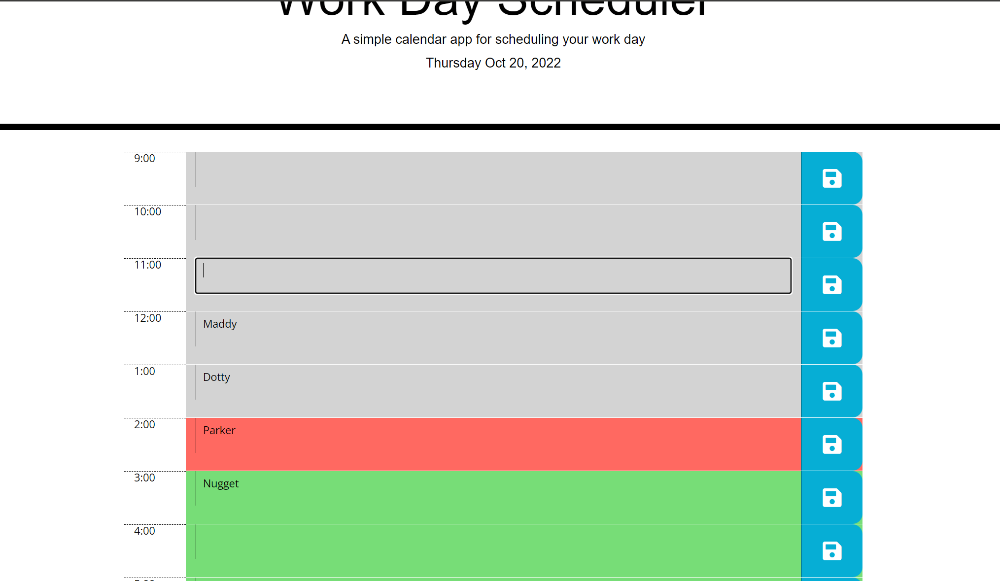

# Work Day Scheduler

## Description

Here is a daily calendar that I used to practice JQuery, Bootstrap, Local Storage (that I struggled with last week), as well as learning how to use Day.js. It shows the date and dynamically changes the hour color with the time.

## Installation

N/A

## Usage

Professionals can use this to save appointments throughout the day, and it will save on a local device when the window is refreshed.

## Credits

Starter code from Xandromus Naming Repo: https://github.com/coding-boot-camp/super-disco
Bootstrap 4.6 https://getbootstrap.com/docs/4.6/getting-started/introduction/
JQuery https://jquery.com/
Day.js https://day.js.org/

## License

Please refer to the LICENSE in the repo.

Website can be found at:
https://prkrgreenwell.github.io/workday-scheduler/
